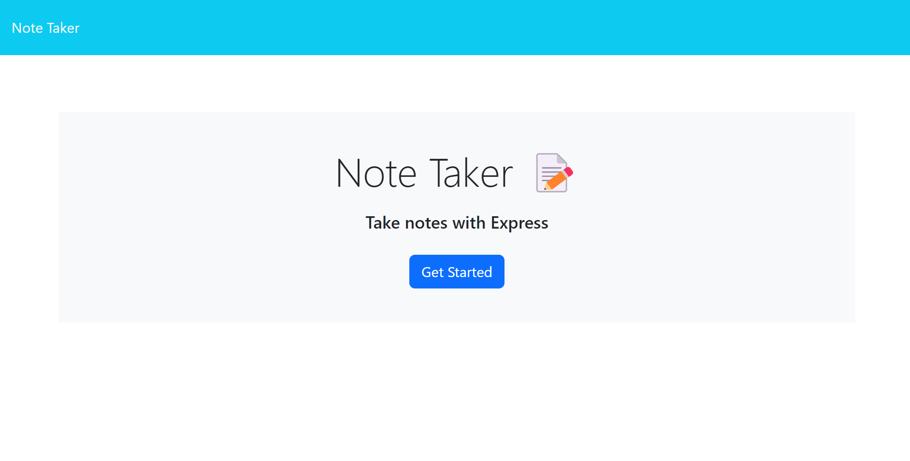
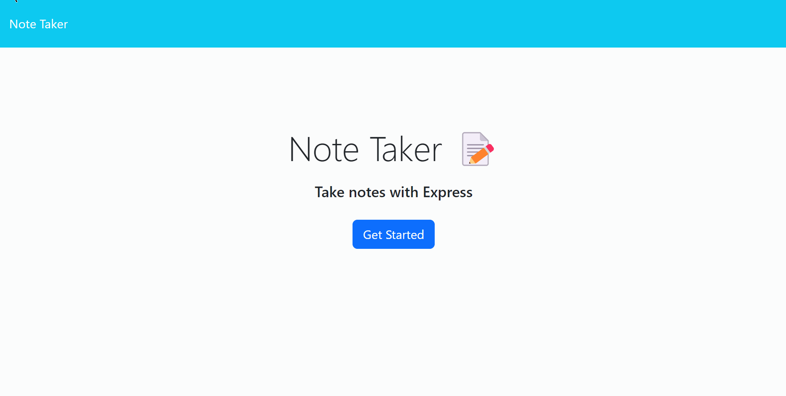
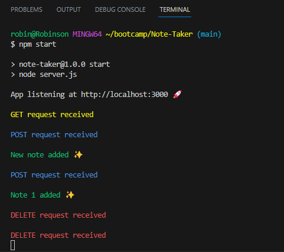

# Note Taker

  ## Description

  This project was developed to help the user manage his tasks and create reminders, where he can enter a title for his task or reminder, fill in the desired notes and save. The saved notes will be visible all the time on the screen to be navigable and deleted when the user requests it.

  ## Table of Contents
  - [Installation](#installation)
  - [Usage](#usage)
  - [License](#license)
  - [Contributing](#contributing)
  - [Credits](#credits)
  - [Questions](#questions)
  
  ## Installation

  Navigate to https://github.com/robinsonfdossantos/Note-Taker.

  Open a local built-in Terminal (powershell, bash) on your local machine.

  Navigate to a desired folder to place your project in, using 'cd "folder"'.

  Use 'git clone' to copy the repository to your local computer by typing "git clone git@github.com:robinsonfdossantos/Note-Taker.git".
  
  ## Usage

  Run the built-in terminal in VS Code. Make sure you have installed all required packages using 'npm install or npm i' command and run the program using 'node server.js or npm start' command.

  If you want to run the page locally, copy the following link to a browser http://localhost:3000/notes or by pressing Ctrl + clinking on the link, you can also deploy your application using Heroku or a similar deployment tool to use in the environment web to access wherever you are.

  First, you will be presented with a welcome page that introduces you to what the following page is designed for.

  

  On the main page you will be presented with a list of notes you have created, where you can manage them by adding new notes or removing them.

  The animation below shows how the page works.
  
  

  If you run the code locally, you can follow the app's backend request in your VS Code's terminal, while running the app.

  This image below illustrates the above animation responses in your local terminal.

  
 
  You can also visit my deployed Note Taker app at the link below.

  https://blooming-citadel-39669.herokuapp.com/notes

  ## License

  This application is covered under the MIT license.
  
  ## Contributing

  All users are very welcome to leave their comments and suggestions for improvement by sending me a direct message or creating pull requests on Github.
  
  ## Credits

  Express.js

  Boot camp members who provided the structure codes.
  
  ## Questions

  For any questions or inquiries, please reach out to me via [GitHub](https://github.com/robinsonfdossantos) or email me at robinsonfdossantos@gmail.com.

